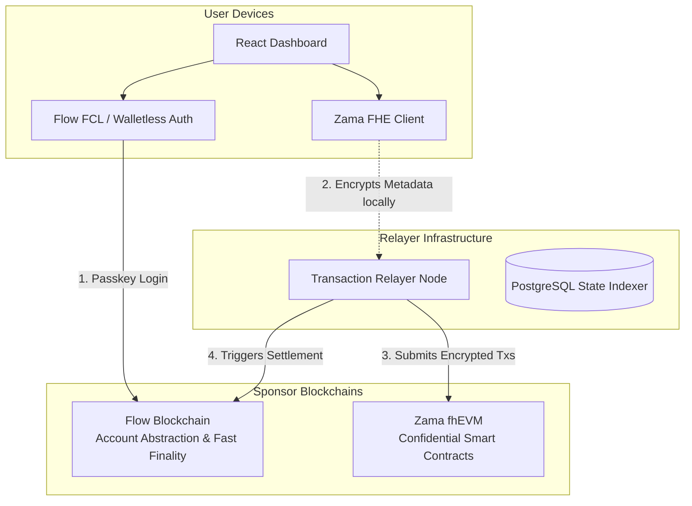
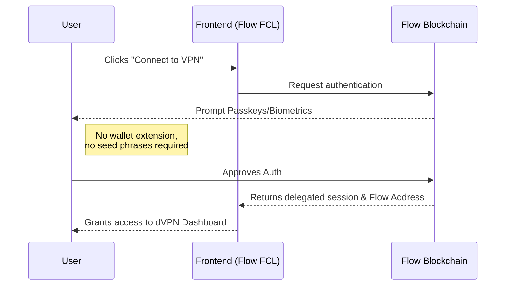
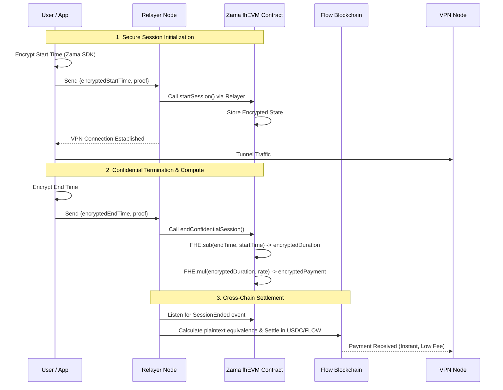

# Confidential-X4PN (Confidential dVPN Platform)

> **Protocol Labs Genesis: Frontiers of Collaboration Hackathon Submission**

**Confidential-X4PN** is a decentralized VPN (dVPN) platform that integrates **Zama's fhEVM** for privacy-preserving session metadata and the **Flow Blockchain** for seamless, walletless user onboarding. 

Our mission is to solve the critical privacy flaw in existing dVPNs—exposing session metadata (start times, end times, and duration) on a public ledger—while delivering a Web2-like user experience.

---

## 🛑 The Problem

Most decentralized VPNs store session metadata on public blockchains. While IP addresses remain hidden, the metadata graph (when you connect, how long you stay connected, and how much you pay) is completely public. This exposes your usage patterns, location timezones, and potentially deanonymizes users through network traffic correlation.

Furthermore, onboarding to a dVPN typically requires users to understand wallets, seed phrases, and gas fees, making mass adoption impossible.

## 💡 The Solution

**Confidential-X4PN** utilizes Fully Homomorphic Encryption (FHE) to encrypt session metadata before transport. Payout executions happen on Flow while preserving minimal metadata exposure in the backend. 

### Key Innovations:
1. **FHE Confidentiality (Zama fhEVM)**: Session start times, end times, and durations are encrypted before being sent on-chain. The smart contract calculates the provider's payment using FHE arithmetic without ever decrypting the underlying usage data.
2. **Web2-Native Usability (Flow)**: We utilize Flow's account abstraction and passkey integration to offer a walletless onboarding experience. Users don't need to save seed phrases or hold crypto to start using the dVPN.
3. **Dual-Termination System**: Sessions can be safely terminated by either the user or the node provider, with the fhEVM guaranteeing that the exact duration is correctly calculated via encrypted state, ensuring fairness.

---

## 🏗️ Architecture & Interaction Flow

To achieve a fully private yet massively scalable dVPN, we combine the **Flow Blockchain** (for UX & settlement) and the **Zama fhEVM** (for encrypted compute).

### 1. High-Level System Architecture


### 2. Walletless Onboarding Flow (Powered by Flow)
Users shouldn't have to manage seed phrases just to use a VPN. We leverage **Flow's Account Abstraction** to enable seamless onboarding.


### 3. Confidential Session Lifecycle (Zama + Flow)
When a VPN session runs, its start/end times remain encrypted. The payment is calculated secretly using **Zama's FHE** and then settled on **Flow**.


---

## 🛠️ Technology Stack

- **Smart Contracts**: Solidity, Zama `@fhevm/solidity`
- **Frontend**: React 19, Vite, Tailwind CSS, Shadcn UI, `@onflow/fcl` (Flow Client Library), Zama Relayer SDK
- **Backend**: Express.js, TypeScript, PostgreSQL (via Drizzle ORM), Ethers.js
- **Blockchain Infrastructures**: Flow Blockchain (Settlement & Auth), Zama fhEVM (Confidential Compute)

---

## 🚀 Key Features

*   **Walletless Login**: Powered by Flow, users authenticate using Passkeys.
*   **Encrypted On-Chain State**: Using `euint64` and `ebool` from Zama, we compute payment vectors invisibly.
*   **Protect Me Autopilot**: Users can schedule Flow-native automated payments to fund their VPN usage seamlessly.
*   **Zero-Trust Architecture**: Neither the VPN Provider nor the blockchain observers can see the actual duration or timestamps of a user's session.

---

## 💻 Running the Project Locally

### Prerequisites
*   Node.js (v18+)
*   PNPM (Package Manager)
*   PostgreSQL database

### 1. Smart Contracts
The contracts are located in the `contracts/` directory. They require a Zama fhEVM compatible network to deploy.
```bash
cd contracts
npm install
npx hardhat compile
# Deploy to Zama testnet
npx hardhat run scripts/deploy.ts --network zama
```

### 2. Backend API Server
The backend handles relayer transactions and session state indexing.
```bash
cd backend
pnpm install

# Setup your .env file
cp .env.example .env
# Fill in your DB credentials and relayer private key

# Push database schema
pnpm run push

# Start the server
pnpm run dev
```

### 3. Frontend Web App
The user-facing portal built with React.
```bash
cd frontend
pnpm install

# Setup your environment variables
cp .env.example .env.local
# Fill in the Contract address, Flow config, and API URL

# Start the dev server
pnpm run dev
```

---

## 🏆 Hackathon Bounties Targeted

This project was built for the **Protocol Labs Genesis Hackathon** and targets the following technological tracks:
*   **Zama**: Implementation of FHE via fhEVM for privacy-preserving dApp state (Confidential session duration calculation).
*   **Flow**: Demonstrating mainstream Web3 adoption using Flow's Account Abstraction, walletless onboarding, and FCL integration.

---

*Built with ❤️ during the PL Genesis Hackathon.*
